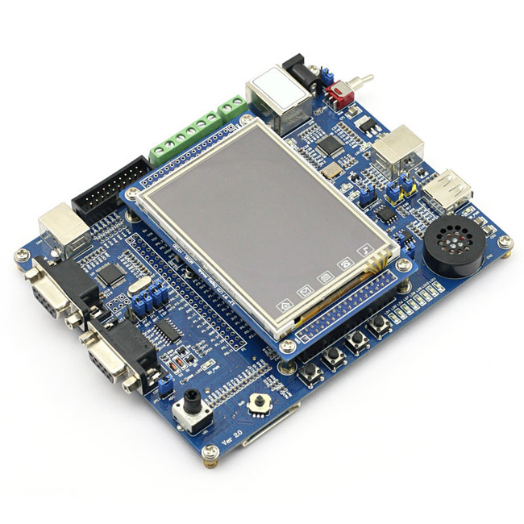

# Advanced Computer Architecture

## Description
A collection of advanced computer architecture laboratories and embedded programming assignments developed for the **Architetture dei Sistemi di Elaborazione** (Computer Architecture) course during the first semester of my Master's Degree in Computer Engineering at **Politecnico di Torino**. The repository explores the intricacies of processor microarchitectures, focusing on **RISC-V** instruction pipelining and stall management, alongside hands-on embedded software development using the **LandTiger** development board.

## Core Competencies & Topics Covered

* **RISC-V Architecture:** In-depth study of the RISC-V Instruction Set Architecture (ISA), instruction encoding, and assembly programming.
* **Processor Pipelining & Stalls:** Analysis and management of pipeline hazards (structural, data, and control hazards). Implementation of hazard detection units, forwarding (bypassing) logic, and pipeline stalling (bubbles) to resolve data dependencies.
* **LandTiger Board (NXP LPC1768):** Bare-metal programming and hardware interfacing on the LandTiger evaluation board (ARM Cortex-M3 core).
* **Embedded System Programming:** Hardware abstraction, memory-mapped I/O, and low-level C programming for microcontroller execution.
* **Interrupts & Peripherals:** Configuring and handling Nested Vectored Interrupt Controllers (NVIC), hardware timers, GPIOs, ADC/DAC, and display interfaces (LCD) on the LandTiger platform.

## Technologies & Tools

* **Architectures:** RISC-V, ARM Cortex-M3 (LandTiger)
* **Languages:** C (Embedded), RISC-V Assembly, ARM Assembly
* **Development Environments:** Keil µVision (for LandTiger), RISC-V Simulators (Gem5)
* **Hardware:** LandTiger NXP LPC1768 Development Board (Emulator & Physical Board)

